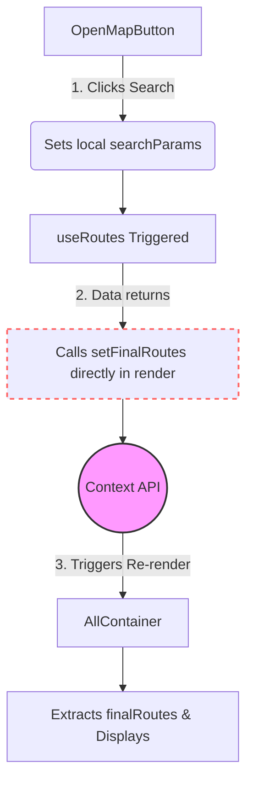
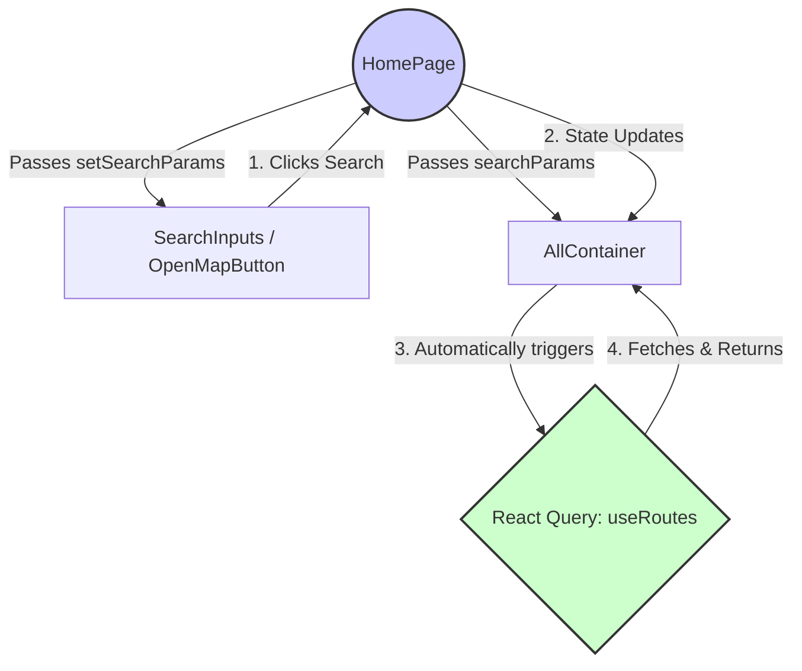

# 📚 Study Guide: Refactoring Search Logic & React Query

This guide explains exactly what we changed in your project, why we changed it, and the underlying React architectural concepts behind it.

---

## 1. The Core Problem (Why we changed it)

In the previous structure, your app suffered from two major React design issues:

1. **The Context API Overkill**: 
   You were using `FoundRoutesContext` to store API response data. However, you are already using `React Query` (`useQuery`). React Query has its own built-in global caching system. Using Context to store data that React Query already stores is redundant and makes your codebase harder to manage.
   
2. **React Anti-Pattern (State updates during render)**:
   In `OpenMapButton.tsx`, you had this code:
   ```tsx
   const { setFinalRoutes } = useRoutesContext();
   if (routes) setFinalRoutes(routes.data); // ❌ DANGER
   ```
   Calling a state setter directly in the body of a component happens during the "render phase". This forces React to abruptly stop rendering, re-render the parent, and then re-render the children. It causes performance bottlenecks and infinite loop warnings.

---

## 2. The Concepts Used to Fix It

### 🧠 Concept 1: "Lifting State Up"
In React, when two sibling components (like your Search Bar and your Results Container) need to share data, you shouldn't use Context immediately. The standard practice is **"Lifting State Up"**. 
We moved the `searchParams` state up to their nearest common parent: `HomePage.tsx`.

### 🧠 Concept 2: "Prop Drilling" (The Good Kind)
Once the state is in `HomePage.tsx`, we pass the exact pieces of that state down as "props" to the children that need them.
* `HomePage` gives `setSearchParams` to `Header` ➜ `SearchInputs` ➜ `OpenMapButton`.
* `HomePage` gives `searchParams` to `AllContainer`.

### 🧠 Concept 3: "Query Keys" in React Query
React Query relies heavily on the `queryKey`. A query key is like a unique ID for a cache.
* **Old way**: `queryKey: ["routes"]`. React Query didn't know the parameters changed, so it might not re-fetch.
* **New way**: `queryKey: ["routes", searchParams]`. Now, whenever `searchParams` changes, React Query automatically detects the change and fires a new network request!

---

## 3. Before vs. After Architecture

Here is how the data flow completely changed:

### 🔴 BEFORE (The Buggy Flow)


### 🟢 AFTER (The Clean Flow)


---

## 4. Summary of File Changes

1. **`HomePage.tsx`**: Became the "source of truth". It now holds `const [searchParams, setSearchParams]`.
2. **`OpenMapButton.tsx`**: Stripped of its fetching logic. It now only calculates coordinates and tells the HomePage what to search for (`setSearchParams(newParams)`).
3. **`AllContainer.tsx`**: Became "smart". It takes the `searchParams` prop, runs the `useRoutes(searchParams)` hook natively, and uses `isLoading` to show a clean native loading spinner.
4. **`foundRoutesContext.tsx`**: Deleted. The complexity is gone.
